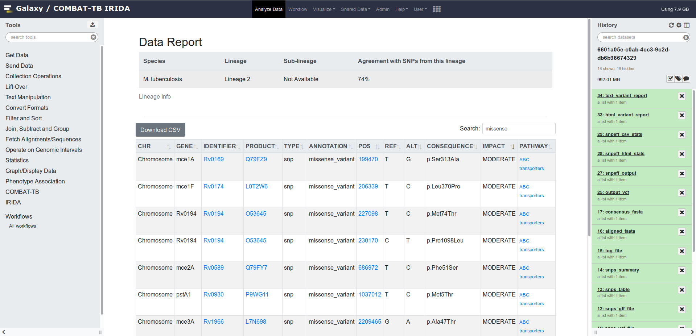

# **tbvcfreport**
[](https://travis-ci.org/COMBAT-TB/tbvcfreport)

A tool to generate an HTML report from SnpEff produced vcf files with links to the
Combat TB Explorer database.


<!--  -->

## Usage

#### Prerequisites:
* [Docker](https://www.docker.com/community-edition) and [docker-compose](https://docs.docker.com/compose/overview/) to be installed.
* An instance of the COMBAT-TB database.
    * See [this repo](https://github.com/COMBAT-TB/neo4j_db) to get up and running.
    * `export DATABASE_URI=localhost`, defaults to [combattb.sanbi.ac.za](http://combattb.sanbi.ac.za). :construction: :computer:

#### To Run

```sh
$ git clone https://github.com/COMBAT-TB/tbvcfreport.git
$ cd tbvcfreport
$ virtualenv envname
$ source envname/bin/activate
$ pip install -r requirements.txt
$ pip install -e .
$ tbvcfreport --help
$ tbvcfreport generate vcf_direcory/
```

This will generate a `{vcf-file-name}.html` file in `pwd`.
